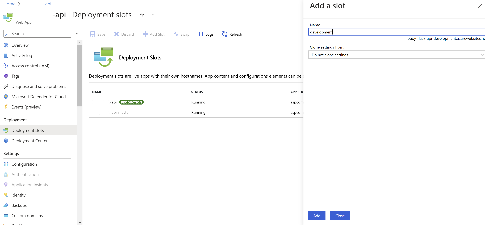

## Motivation

Replace CLI deployments with continuous integration (CI)/ continuous delivery (CD) pipelines.

Most of the the apps I deployed in Azure were maintained in Docker containers which allowed to configure a container app deployment in Azure and run deployments by pulling the container image from a registry. For this, I used Azure Command-Line Interface (CLI) to write the set of commands required to push the container from the developer's environment to the Azure resource. This approach is useful as CLI commands can be written in a Makefile where they can be run everytime a new update is needed and avoid the tedious process of manuallly redeploy the web app in Azure portal. However, the CLI deployment approach had several challenges in my expericence:

1. write and test the CLI commands for each project takes time and often is is not a straightforward tasks to do.
1. Azure can take about 5 minutes to respond to and deploy the new changes in the web app, this is tricky as often the developer is under a lot of pressure and check the resource and not see the changes expected can lead her to assume that deployment was unsucessfull when in the reality Azure is still working on it.
1. it is hard to keep track of the code base used in production as developers can make changes in the code and not use this version to redeploy the web app where it is hosted
1. developers might work on on different operational systems and on this case setting up a local environment to debug and run CLI commands stored in Makefiles can be an issue.

According to [GitLab](https://about.gitlab.com/topics/ci-cd/):

:::note

CI/CD automates much or all of the manual human intervention traditionally needed to get new code from a commit into production, encompassing the build, test, and deploy phases, as well as infrastructure provisioning. With a CI/CD pipeline, development teams can make changes to code that are then automatically tested and pushed out for delivery and deployment. Get CI/CD right and downtime is minimized and code releases happen faster.

CI/CD is an essential part of DevOps and any modern software development practice. A purpose-built CI/CD platform can maximize development time by improving an organization's productivity, increasing efficiency, and streamlining workflows through built-in automation, testing, and collaboration. As applications grow larger, the features of CI/CD can help decrease development complexity. Adopting other DevOps practices helps organizations break down development silos, scale safely, and get the most out of CI/CD.

:::

With the code base in GitHub repositories I followed the steps below to set up CI/CD pipelines for each stage of the app development.

## Create deployment slots for your app

According to [Azure]((https://learn.microsoft.com/en-us/azure/app-service/deploy-staging-slots?tabs=portal)):

- *"Continuous deployment should never be enabled for your production slot. Instead, your production branch (often main) should be deployed onto a nonproduction slot. When you're ready to release the base branch, swap it into the production slot. Swapping into production—instead of deploying to production—prevents downtime and allows you to roll back the changes by swapping again."*

*Best practice for configuring a CI/CD pipeline for multiple web app deployment slots in Azure. Image sourced from [Continuously deploy code](https://learn.microsoft.com/en-us/azure/app-service/deploy-best-practices#continuously-deploy-code)*

- *Deploying your application to a nonproduction slot has the following benefits:*

  - *You can validate app changes in a staging deployment slot before swapping it with the production slot.*

  - *Deploying an app to a slot first and swapping it into production makes sure that all instances of the slot are warmed up before being swapped into production. This eliminates downtime when you deploy your app. The traffic redirection is seamless, and no requests are dropped because of swap operations. You can automate this entire workflow by configuring auto swap when pre-swap validation isn't needed.*

  - *After a swap, the slot with previously staged app now has the previous production app. If the changes swapped into the production slot aren't as you expect, you can perform the same swap immediately to get your "last known good site" back.*

Create slots in Azure is simple. After creating your Web App resource in Azure, go to *Deployment Slots* and *+ Add* as many slots as needed

After doing this, you can go back to the resource group where the web app was created to check that the slots are now available

and select `GitHub Actions: Build, deploy, and manage your container app automatically with  GitHub Actions`

If your project has designated branches for testing, QA, and staging, then each of those branches should be continuously deployed to a staging slot. (This is known as the Gitflow design.) This allows your stakeholders to easily assess and test the deployed branch.

Continuous deployment should never be enabled for your production slot. Instead, your production branch (often main) should be deployed onto a nonproduction slot. When you're ready to release the base branch, swap it into the production slot. Swapping into production—instead of deploying to production—prevents downtime and allows you to roll back the changes by swapping again.

## Set up a CI/CD pipeline

From the development slot of your application, go to *Deployment Center* and select `GitHub Actions: Build, deploy, and manage your container app automatically with  GitHub Actions`

Fill out the *GitHub Actions* and *Registry settings* as in the example below. Note that you will need to have a *container registry* in the same subscription of your web app. You will also need to ensure that *Admin user* is enabled for your *container registry*, you check this in the *Access key* menu in the *container registry* page.

Preview the file generate based on your settings and press *Save* (at the top) when you are ready. This will create `.github/workflows` directory in your [repository](https://docs.github.com/en/actions/using-workflows/about-workflows):

"*"A workflow is a configurable automated process that will run one or more jobs. Workflows are defined by a YAML file checked in to your repository and will run when triggered by an event in your repository, or they can be triggered manually, or at a defined schedule.*"

If the workflow is not trigerring and you cannot see the "Actions" menu at the top of your repo, check if this feature is enabled in *Settings -> Actions -> General*.

Make a small change in your code base (can be in the README file) to trigger the pipeline and deploy the app to the deployment slot.

## Swap slots

Once the CI/CD pipelines are set to *master* and *development* and apps are running as expected, swaps are ready to be performed.

To swap master into production, simply *Swap* specifying the source and target (master and production, respectively in this case).

