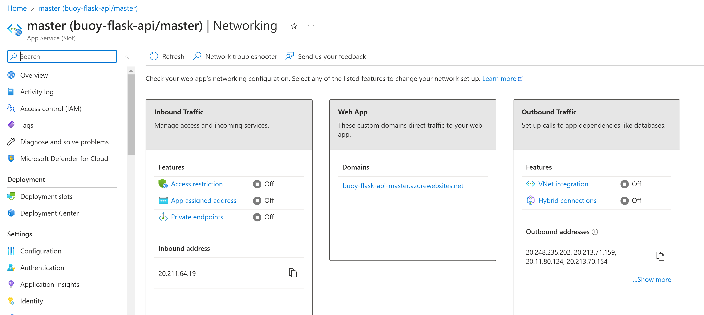
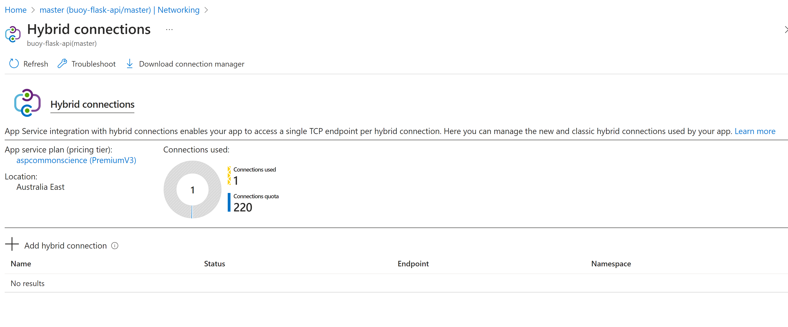
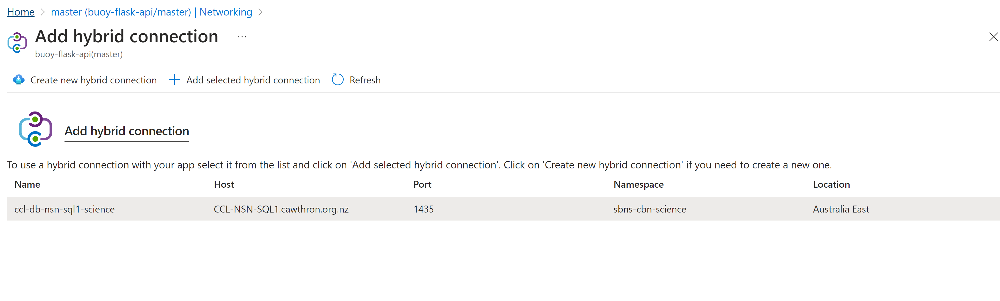
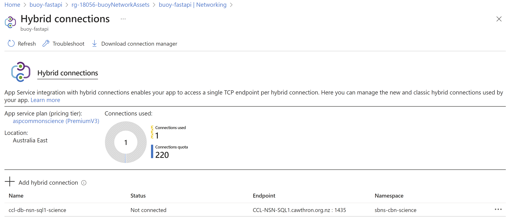

In this short tutorial are the steps to set up an App Service Hybrid Connection. This type of connection is required to allow apps to access on-premises systems and services securely.

Go to networking menu and Outband traffic

Add a connection

Select the hybrid connection in the list and add

Check if the hybrid connection was added correctly

