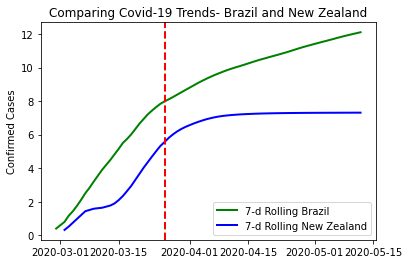

---
authors:
- admin
categories: [Python]
date: "2020-15-04"
draft: false
featured: false
# image:
#   caption: ""
#   focal_point: ""
# projects: []
# subtitle: Learn how to blog in Academic using Jupyter notebooks
summary: Basic code to compare Covid-19 curves 
tags: ["data wrangling", "covid", "pandas"]
title: How to Compare Covid-19 Curves in Python
---

---

# Motivation
- Work with Covid-19 dataset 
- Compare the curve from my home country Brazil (no social distance and insufficient testing - https://www.theguardian.com/world/2020/may/06/brazil-coronavirus-deaths-covid-19-bolsonaro) and New Zealand (four weeks of lockdown and with a recognized elimination strategy - https://edition.cnn.com/2020/04/28/asia/new-zealand-coronavirus-outbreak-elimination-intl-hnk/index.html)

# Source:
To structure the code below two main references were used:
- https://www.dataquest.io/blog/tutorial-time-series-analysis-with-pandas/
- https://opensource.com/article/20/4/python-data-covid-19

# Coding:

Import libraries

```python, message=FALSE, warning = FALSE
import pycountry
import pandas as pd
import numpy as np
import matplotlib.pyplot as plt
import seaborn as sns
```

Import the dataset

*Find additional information about the dataset here: https://github.com/datasets/covid-19*

```python

URL_DATASET = r'https://raw.githubusercontent.com/datasets/covid-19/master/data/countries-aggregated.csv'
df1 = pd.read_csv(URL_DATASET)

```

Select only the data needed and get it in the right shape to the analysis

```python
## Filtering and Wrangling
df1 = df1.filter(["Country", "Date", "Confirmed"]) ## Select only the columns of interest
bra_nz = df1.loc[df1["Country"].isin(['Brazil','New Zealand'])]  ## Select the countries to be analysed
bra_nz["Date"] = pd.to_datetime(bra_nz["Date"]) ## Set the right format to Date column
bra_nz=bra_nz.pivot(index='Date', columns='Country', values='Confirmed') ## Reshape the dataset
## Define columns
data_columns = ['Brazil', 'New Zealand'] 
```

Perform a log transformation on the number of confirmed cases and set a rolling window of seven days
```python
## And index retrieveing month
## and rolling
bra_nz_7d = np.log(bra_nz[data_columns]).rolling(7, center=True).mean() ## The logarithmic scale improves the rate                                                                         ## change analysis and the rolling window                                                                          ## smooths the graph 
```
Plot the curves and a red vertical line indicating the first day of New Zealand lockdown

```python
# Plot 7-day rolling mean time series for the confirmed cases of Brazil and New Zealand:
fig, ax = plt.subplots()
ax.plot(bra_nz_7d['Brazil'], linewidth=2, label='7-d Rolling Brazil', color='green')
ax.plot(bra_nz_7d['New Zealand'], linewidth=2, label='7-d Rolling New Zealand', color='blue')
ax.axvline(pd.to_datetime('2020-03-26'), color='r', linestyle='--', lw=2)

# Set x-ticks to yearly interval and add legend and labels
ax.legend()
ax.set_ylabel('Confirmed Cases')
ax.set_title('Comparing Covid-19 Trends- Brazil and New Zealand');
```





```python

```
