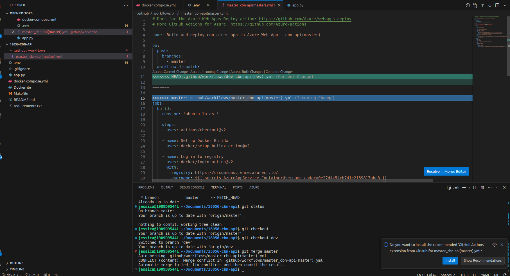

Conflicts can happen in various ways when working in a Git repository. This post covers how conflicts can be resolved when from new pull requests.

## Make a pull request

Switch to the "master" Branch or the branch where you want to merge these changes:

`git checkout master`

Merge the "dev" Branch into "master": Merge your "dev" branch into the "master" branch using the git merge command:

`git merge dev`

## Resolve conflicts

Step 1: Update your local repository with the latest changes.

`git pull origin master`

Step 2: Merge the base branch into the head branch.

`git merge master`

Step 3: Resolve Conflicts (if any): 

If there are any merge conflicts, you'll need to resolve them during the merge process. Git will guide you through resolving conflicts.

See [Resolving a merge conflict using the command line for step-by-step instructions on resolving merge conflicts](https://docs.github.com/en/pull-requests/collaborating-with-pull-requests/addressing-merge-conflicts/resolving-a-merge-conflict-using-the-command-line).

This is an example how it looks like in VScode

Step 4: Commit the Merge (if necessary): After resolving conflicts, you may need to commit the merge changes. If Git does not automatically commit the merge, use:

`git commit -m "Merge dev into master"`

Step 5: Push the Changes: Once the merge is complete and you are satisfied with the result, push the changes to the remote repository:

`git push origin master`

By following these steps, you can merge the changes from a specific commit in the "dev" branch into the "master" branch. This allows you to selectively merge the changes from one script or file while keeping the other changes separate.

Step 6: Push the changes.

`git push -u origin dev`