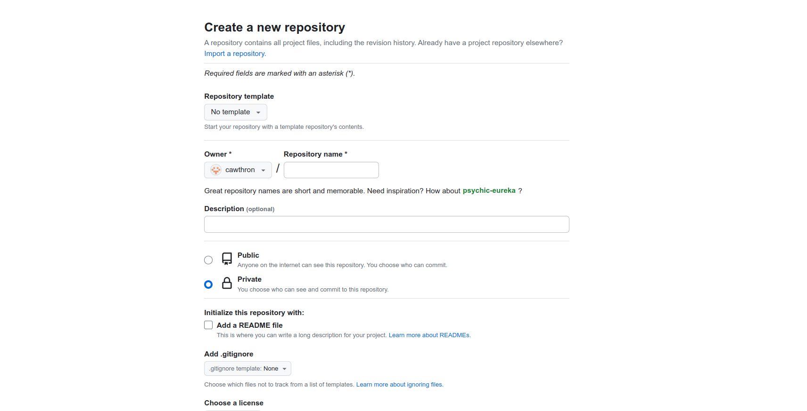
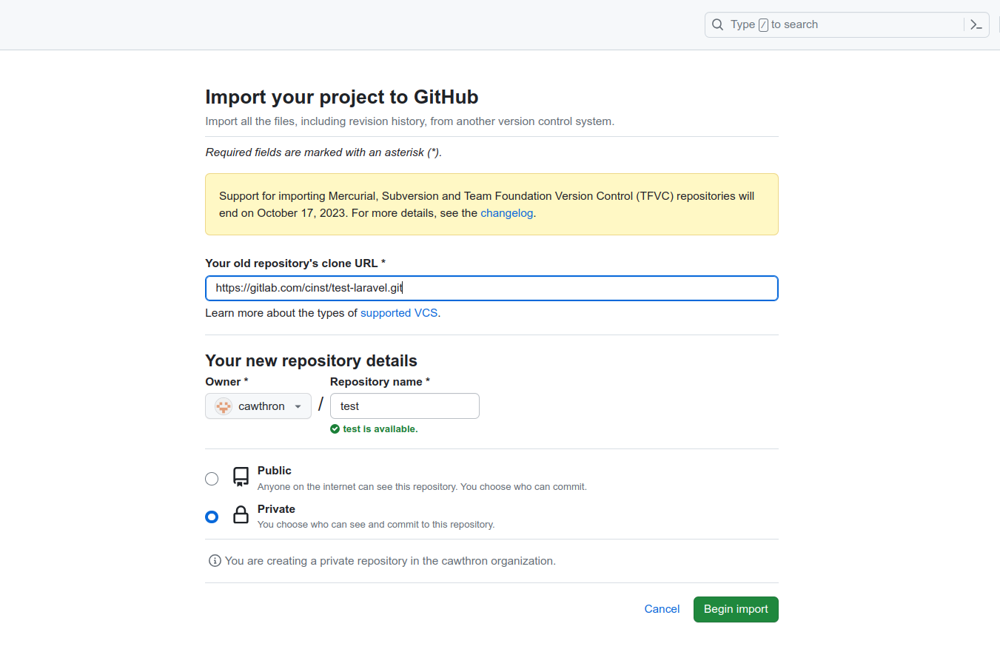
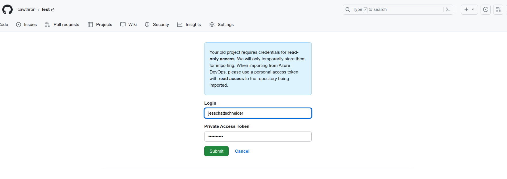
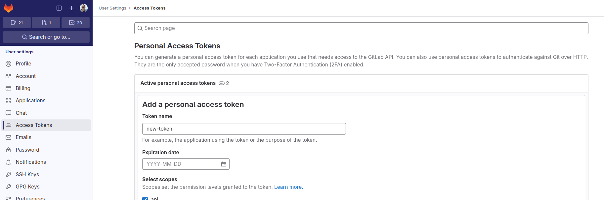
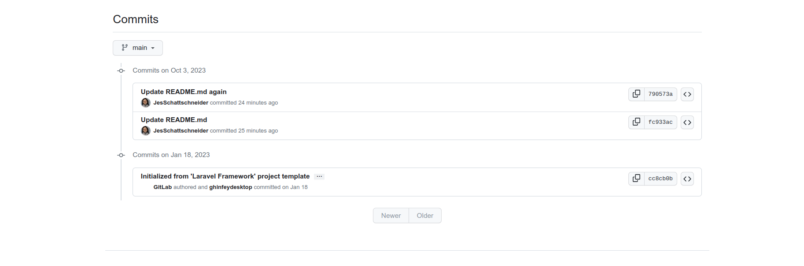
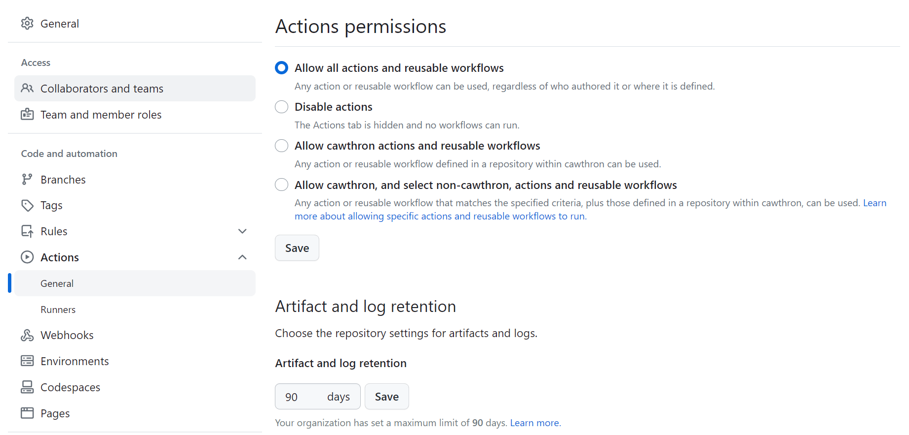

## Motivation

As part of our the new data science insfrastructure plan we aim to centralise the deployment of project applications in a single cloud service (as much as we can), using Azure as the cloud provider for this task. We also want to reduce the burded of deploying apps to different environments by setting up continuous integration (CI)/ continuous delivery (CD) pipelines.

Although setting up CI/CD pipelines using GitLab-CI to deploy to Azure is supported it is simpler to set up the pipeline using GitHub Actions and the recommended practice for [greater operational efficiency](https://learn.microsoft.com/en-nz/azure/app-service/deploy-best-practices#use-github-actions). Therefore, the objective of this post is to document the steps taken to migrate a repository from GitLab GitHub. The advantage of migrating an existing project between these two git management systems in comaprisson of creating a new repository and just pulling the current code base from the old repo into the new one is that the migration operation also migrates pull the history of pull requests and commits.

## Migrate a GitLab project to GitHub

Go to the main page and create a `New` repository and then click on `Import a respository` link at the top.

Now got to Gitlab and copy the HTTPS key for your project and paste it in `Your old repository's clone URL` field in the Github migration page and select `Start migration`

If this window pops up, add your login and your existing **Gitlab** Private Access Token if you have one.

If you don't have or don't remember your token you can create one on `Settings - Access tokens` in the Gitlab portal and generate a new token

Once the migration is complete, you can check that the new repository is in Github with all branches and commit history

## Retire GitLab

To avoid developers to accidentally develop from the code base available in GitLab, we "retired" the repo by creating a new branch from main called "backup".
We then deleted all code in main leaving only a README.txt file with a message with a link to the GitHub repository where it is being maintained.

## Bonus

If you pretend to use GitHub Actions, make sure you allow this feature in *Settings -> Actions -> General* as it can be set as *Disable actions* as the default option from the migration task.

