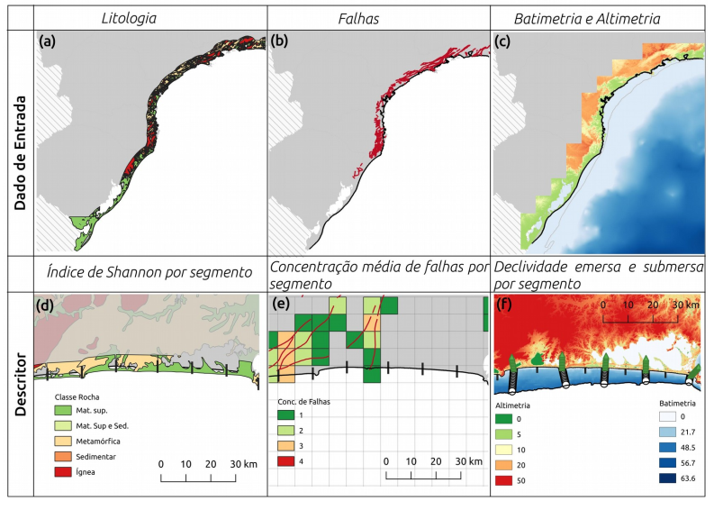

The coastline is the limit between the terrestrial and the maritime environment reflecting in its
shape the interaction of continental and marine processes, presenting it as an interesting
feature for coastal characterization. In this sense, this current project analyses by quantitative
descriptors the morphological complexity of the south-southest brazilian coastline. Three
different techniques are used to reach this objective, two of them are based in fractal theory
and one in angular variation. The whole methodology is based in a reproducible R-code using public databases. In the characterization using fractal methods, the complexity of four
coastline compartments of the study are measured by the fractal dimension (D). The adjustment of the fractal curve (R2) and the type of data used indicates that the step-divisor is the best method in this case. In a second moment of this project, the Angular Measurement Technique (AMT) is applied to the coastline without a previous compartmentalization, reaching to classify coastline segments in complexity classes. Nine different scale lengths (S) we considered in an hierarchic cluster indicating that the strudy area can be classified in four different complexity groups. Segments classified by Group 01 have low complexity being associated to straight coastline, Group 02 has an
intermediate complexity while Group 03 and 04 have a higher complexity being segments of
Group 04 normally associated to headlands and bays. Additionally,the relationship between
this morphological classification is compared to the variability four coastal descriptors, the
lithological diversity, the concentration of structural faults and the submerged and emerged
slope. 

*Image 1. Methodological framework with a general visualisation of the input data in the first row (lithology, geological faults and bathimetric and topographic data, respectively), and on the second row is a sampled of the scheme used to obtain the four coastal descriptor for each costal segment (Shannon index, concentration of faults, submerged and emerged slope, respectively).*

Principal Component Analysis (PCA) shows that the lithological diversity and the
concentration of faults control the coastline morphology in the scale evaluated by this study,
possibly reflecting the influence of the Serra do Mar proximity in some segments. However,
the smoothed curve of each complexity group obtained by the generalized additive model
(GAM) from the individual bathymetric and altimetric profiles shows a variation between the
pattern observed for each group, indicating a relation with the morphological expression of
the coastline.

*Image 2. Principal Component Analysis for the four complexity groups (represented by points) in relations to the four coastal descriptors (represented by arrows being translated from portuguese to english as follow: Decliv. Sub = Submerged Slope; Decliv. Emersa = Emerged Slope; Div. Geo = Shannon Index; Conc. Falhas = Fault Concentration). This analysis highlights the geological diversity on controlling the morphological expression of the coastline in mesoscale*

The full dataset and the final code are freely available in my [github]( https://github.com/JesSchattschneider/Dissertation.git)