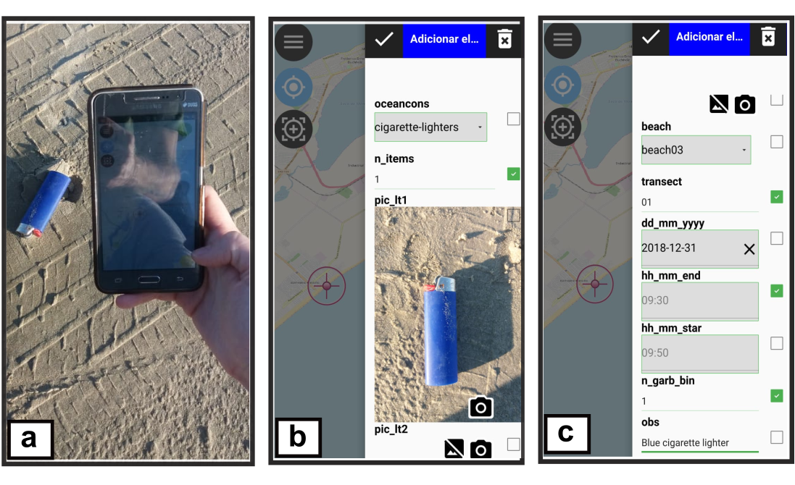
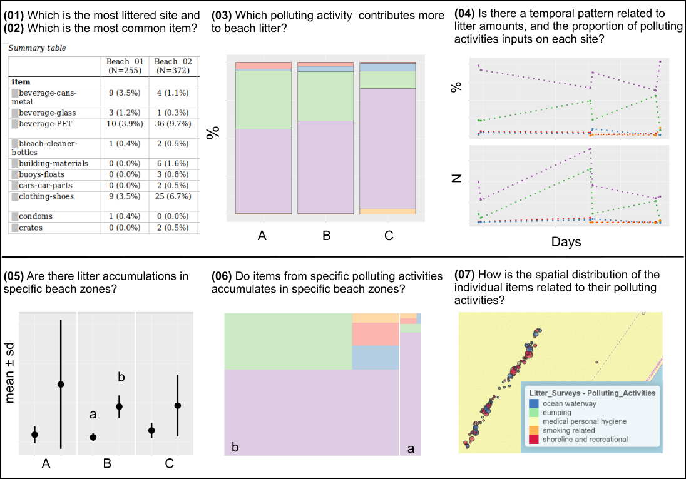
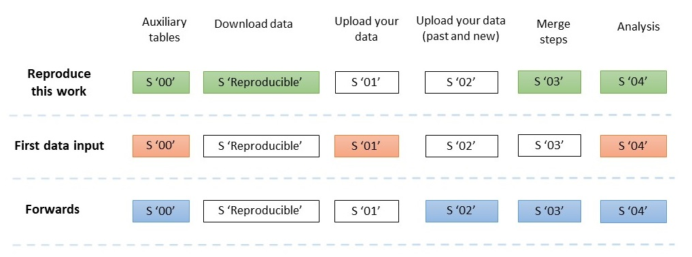

This project is a framework for a beach litter monitoring, based on free and open-source software (FOSS), which allows adjustments for any sampling design. The framework was developed by means of a GIS-project (QGIS), a GIS-collector (QField), and an R code, allowing further adjustments according to the area to be surveyed, and research questions. All facilities are FOSS, not implying any costs. The aim is to improve data collection, accessibility, and interoperability, and to help to fill the current existing gap between fieldwork and data analysis, preventing typos and allowing better data processing. 

*Image 1. The mobile-app QField in the fieldwork. (a) Record the item; (b–c) fill the attributes.*

Therefore, less than an hour is expected from ending the fieldwork to the resulting up-to-date products. Results obtained from the open-source geospatial framework application produces baseline information on beach litter issues, such as amounts, sources, spatial and temporal patterns. 

*Image 2. Summary of graphical and descriptive results and the questions that these individual products respond. Colours are related to different polluting-activities, capital letters (A, B, C) represents different sites, and lower case letters (a, b) different beach areas.*

The adoption of the framework can facilitate the data collection by local and regional councils as it dispense any financial investments, and the results obtained from it can be applied to base management strategies. For researchers, it produces spatialized data from each item in tidy forms.

*Image 3. Coloured cells indicate the steps to be run in the code, depending on the users purpose (reproduce results; first input of data; or, second data input onwards).*

This project was submitted to the Environmental Monitoring and Assessment Journal (Manuscript status: *in review*) and the full code is available  [here](https://github.com/JesSchattschneider/litter/blob/master/ReproducibleRcodeLitter.R)